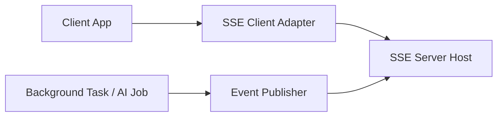

# Architecture Overview

This document describes the high-level architecture of the system and how
the library abstracts Server-Sent Events (SSE) to provide reliable,
unidirectional real-time updates.

The design prioritizes **simplicity**, **scalability**, and **clear
separation of concerns**.

---

## High-Level Architecture

At a high level, the system consists of three main parts:

1. **Client Application**
2. **SSE Abstraction Layer (This Library)**
3. **Backend Application / Services**

The client subscribes to updates, the backend publishes events, and the
library acts as the orchestration layer between them.

---

## Component Diagram



## Core Flow

The typical flow for a long-running task is as follows:
1. The client initiates an operation (e.g., evidence matching).
2. The backend starts a background job.
3. The client opens an SSE connection to subscribe to updates.
4. The background job publishes status events.
5. The server streams updates to the client in real time.
6. The client reacts to updates without polling or manual refresh.

# Server-Side Architecture

## SSE Endpoint
 The backend exposes a dedicated SSE endpoint:
- Uses standard HTTP
- Keeps the connection open
- Streams events in a structured format
- Supports multiple concurrent subscribers

The library handles:
- Connection setup
- Event formatting
- Heartbeats
- Retry configuration

## Event Publisher

Business logic does not write directly to the SSE stream.

Instead:
- Services publish events via an Event Publisher
- The publisher forwards events to active SSE connections
- The library ensures consistent event naming and payload structure

This decoupling allows:
- Clean business logic
- Easier testing
- Future extensibility

# Client-Side Architecture

## SSE Client Adapter
On the client side, the library provides a thin abstraction over EventSource.

Responsibilities:
- Opening and closing connections
- Automatic reconnection handling
- Event subscription management
- Error propagation

The application interacts with events, not with raw SSE mechanics.

# Event Model
Events follow a consistent structure:

```json
{
  "event": "task.progress",
  "data": {
    "taskId": "123",
    "status": "IN_PROGRESS",
    "percentage": 70
  }
}
```
Key characteristics:
- Strongly typed on the server
- Predictable on the client
- Self-describing event names

# Design Principles

This architecture follows a few core principles:

- Unidirectional by design
- Loose coupling between components
- Opinionated defaults, flexible internals
- Minimal surface area for consumers